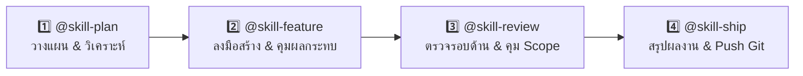
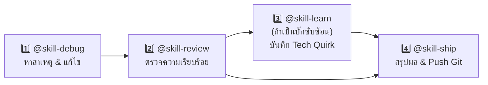

# 🐻 Bear Cafe Bot — Agent Skills System Guide

คู่มือมาตรฐานการใช้งาน **Agent Skills** สำหรับโปรเจกต์ Bear Cafe Bot ออกแบบมาเพื่อลดขั้นตอนการทำงาน (Consolidated Workflow) จากเดิม 17 ทักษะย่อย ให้เหลือเพียง **6 Core Skills** ตามวงจรการพัฒนาจริง ช่วยให้เรียกใช้ผ่านสัญลักษณ์ `@` ใน Antigravity IDE ได้อย่างรวดเร็ว แม่นยำ และไม่สับสน

---

## 🗺️ แผนผังลำดับขั้นตอนการใช้งาน (Workflow Pipelines)

การทำงานจริงจะแบ่งออกเป็น 2 ลูปหลัก: **การสร้าง/ปรับฟีเจอร์** และ **การแก้บั๊ก/รับมือปัญหา**

### ลูปที่ 1: พัฒนาฟีเจอร์ใหม่ / ปรับปรุงระบบ (Feature Development Loop)



1. **Step 1: วางแผนและออกแบบ (`@skill-plan`)**
   - ใช้เมื่อมีโจทย์ใหม่ หรือต้องการขยายระบบ
   - AI จะตั้งข้อสงสัย สำรวจโค้ดจริง ทำตารางเปรียบเทียบ (Trade-off Matrix เช่น In-Memory vs Supabase) และร่างแผนงานพร้อมรายการไฟล์ที่จะแก้
2. **Step 2: ลงมือพัฒนาโค้ด (`@skill-feature`)**
   - สแกนผลกระทบข้ามระบบ (Blast Radius) ทั้ง Discord Bot, Database และเว็บ `bear-cafe-web`
   - พัฒนาตามโครงสร้างคลีน: Service Logic -> Controller Handler -> UI Components V2 / Canvas
   - จัด Format console log ให้สวยงามตามมาตรฐานระบบ
3. **Step 3: ตรวจสอบคุณภาพและความปลอดภัย (`@skill-review`)**
   - ตรวจความปลอดภัยครบ 4 มิติ: Discord API (ดัก 3s Timeout), Supabase (RLS/Egress), คุณภาพโค้ด และสั่ง **"Good Enough - หยุดแก้"** ในจุดที่ผ่านแล้ว
4. **Step 4: สรุปงานและส่งมอบ (`@skill-ship`)**
   - กรองโค้ดตกค้าง (Tokens, TODOs, console.log รกๆ)
   - สร้างสรุปผลงานสวยงามพร้อมก๊อปปี้ส่งใน Discord
   - สร้าง Conventional Commit message และรัน Git Push เมื่อยืนยัน

---

### ลูปที่ 2: วินิจฉัยและแก้ปัญหา (Incident & Bugfix Loop)



1. **Step 1: วินิจฉัยและแก้บั๊ก (`@skill-debug`)**
   - รองรับทั้งกรณีมี Error log / Stack trace หรือกรณีที่ระบบทำงานผิดปกติแต่ไม่มี log
   - ไล่เรียง Expected vs Actual หา Root Cause และแก้โค้ดเฉพาะจุดความเสี่ยงต่ำ
2. **Step 2: ตรวจความเรียบร้อย (`@skill-review`)**
   - ตรวจสอบว่าจุดที่แก้ไม่สร้างผลข้างเคียง (Regression) หรือกินโควตา Supabase เพิ่ม
3. **Step 3: บันทึกองค์ความรู้ (`@skill-learn`)** *(ถ้าเข้าข่าย)*
   - หากเป็นบั๊กเชิงเทคนิค เช่น Discord 3-second Timeout, Supabase Egress Quota, หรือ Canvas ภาษาไทย บันทึกเข้า KNOWLEDGE ฐานข้อมูลกลางทันที
4. **Step 4: สรุปและปล่อยอัปเดต (`@skill-ship`)**
   - ออกรายงาน Discord Summary และ Commit/Push ขึ้น GitHub

---

## 📚 รายละเอียดและวิธีเรียกใช้งาน 6 Core Skills

---

### 1️⃣ `@skill-plan` — วางแผน ออกแบบ และวิเคราะห์ทางเลือก
* **รวมความสามารถของ:** `skill-system-consult` + `skill-inquire-refine` + `skill-plan`
* **หน้าที่:** วิเคราะห์ความต้องการเชิงลึก ตั้งข้อสงสัย ค้นหลักฐานในโค้ด เปรียบเทียบทางเลือก (Trade-offs) ออกแบบสถาปัตยกรรม และวาง Implementation Plan ก่อนลงมือแตะต้องโค้ด
* **เมื่อไหร่ควรใช้:** 
  - เมื่อได้รับโจทย์ฟีเจอร์ใหม่ แต่ยังไม่แน่ใจเรื่องการออกแบบ
  - เมื่อโจทย์มีความคลุมเครือ และต้องการให้ AI ถามคำถามชี้ขาดก่อนเริ่มทำ
  - ต้องการ Checklist รายการไฟล์ที่จะแก้ แผนสำรอง และการประเมิน Supabase Egress
* **ตัวอย่างการสั่ง:**
  ```text
  @skill-plan ต้องการทำระบบสะสมแต้มเวลาอยู่ในห้องเสียง แล้วให้แลกไอเทมในหน้าเว็บ bear-cafe-web ได้ ช่วยเปรียบเทียบทางเลือกและวางแผนระบบให้หน่อย
  ```

---

### 2️⃣ `@skill-feature` — พัฒนาฟีเจอร์ ปรับโครงสร้าง และควบคุมผลกระทบ
* **รวมความสามารถของ:** `skill-feature` + `skill-refactor` + `skill-impact-analysis` + `skill-logger`
* **หน้าที่:** ลงมือสร้างฟีเจอร์ใหม่หรือ Refactor โค้ดเดิม โดยบังคับใช้มาตรฐาน Clean Architecture (แยก Service, Controller, UI Payload) พร้อมสแกนหาไฟล์เชื่อมโยง (Blast Radius) ทั้ง Bot, Supabase และหน้าเว็บ `bear-cafe-web` ไม่ให้เกิดปัญหาแก้ไม่ครบจุด
* **เมื่อไหร่ควรใช้:**
  - ลงมือเขียนโค้ดตามแผนที่วางไว้
  - ปรับปรุงโค้ดที่รกรุงรัง (Spaghetti Code) แยกโค้ดออกจาก Interaction Handler
  - เปลี่ยนชื่อตัวแปร, Game ID, Custom ID, Database Column ที่แชร์ระหว่าง Bot กับ Web
* **ตัวอย่างการสั่ง:**
  ```text
  @skill-feature พัฒนาระบบร้านค้าแลกของรางวัลตามแผนที่วางไว้ พร้อมสแกนผลกระทบไปยังหน้าเว็บ bear-cafe-web
  ```

---

### 3️⃣ `@skill-debug` — วินิจฉัยและแก้ปัญหาบั๊กทุกระดับ
* **รวมความสามารถของ:** `skill-analyze-log` + `skill-diagnose-system` + `skill-fix-error`
* **หน้าที่:** สืบหาสาเหตุรากเหง้า (Root Cause) ของปัญหา ไม่ว่าจะมี Error log หรือไม่มี log ก็ตาม จากนั้นดำเนินการแก้ไขเฉพาะจุดอย่างปลอดภัย และตรวจสอบยืนยันผลลัพธ์
* **เมื่อไหร่ควรใช้:**
  - บอตแจ้ง Error 10062 Unknown Interaction หรือ Supabase Error
  - ฟีเจอร์ทำงานไม่ครบ เช่น กดปุ่มแล้วแต้มไม่ลด ข้อมูลในเว็บไม่ขึ้น
  - มี Runtime crash หรือระบบค้าง
* **ตัวอย่างการสั่ง:**
  ```text
  @skill-debug ผู้ใช้กดรับกล่องรางวัลแล้วสถานะขึ้นโหลดค้าง ไม่มี error ใน console ช่วยตรวจสอบหาสาเหตุและแก้ไขให้หน่อย
  ```

---

### 4️⃣ `@skill-review` — ตรวจสอบคุณภาพ ความปลอดภัย และควบคุมขอบเขต
* **รวมความสามารถของ:** `skill-review-code` + `skill-discord-check` + `skill-supabase-check` + `skill-audit`
* **หน้าที่:** ออดิตคุณภาพโค้ดแบบครบวงจรในรอบเดียว (Discord Safety, Supabase RLS/Egress, Logic Bugs, Memory Leaks) พร้อมทั้งประกาศชัดเจนว่าส่วนใดถือว่า **"Good Enough"** ให้หยุดแก้เพื่อป้องกัน Over-engineering
* **เมื่อไหร่ควรใช้:**
  - เขียนฟีเจอร์หรือแก้บั๊กเสร็จแล้ว และต้องการรีวิวความถูกต้องก่อน Push
  - ต้องการประเมินความปลอดภัยและประสิทธิภาพของ Supabase queries
  - รู้สึกว่ากำลังติดลูปแก้ไม่จบ ต้องการให้ออดิตและสั่งตัดจบ
* **ตัวอย่างการสั่ง:**
  ```text
  @skill-review ช่วยรีวิวโค้ดระบบคาเฟ่ที่เพิ่งแก้ไป ตรวจดูว่ามีจุดเสี่ยงเรื่อง Timeout หรือ Egress รั่วไหลหรือไม่
  ```

---

### 5️⃣ `@skill-ship` — สรุปรายงานผลงานและเตรียมขึ้น Production
* **รวมความสามารถของ:** `skill-summary` + `skill-pre-deploy`
* **หน้าที่:** ด่านตรวจสุดท้ายก่อน Commit/Push ตรวจสอบว่าไม่มี Token หลุด หรือ console.log รก พร้อมสร้างการ์ดสรุปผลงานในรูปแบบ Discord Markdown สำหรับส่งให้ทีม และสร้าง Conventional Commit
* **เมื่อไหร่ควรใช้:**
  - เมื่อการทำงานเสร็จสมบูรณ์และพร้อมบันทึกลง Git
  - ต้องการสรุปสั้นๆ เอาไปวางรายงานในเซิร์ฟเวอร์ Discord
* **ตัวอย่างการสั่ง:**
  ```text
  @skill-ship ตรวจสอบความเรียบร้อยและสรุปรายงานสิ่งที่ทำวันนี้ให้ด้วย
  ```

---

### 6️⃣ `@skill-learn` — คลังบันทึกความรู้และเทคนิคเฉพาะระบบ
* **หน้าที่:** บันทึกข้อจำกัดเชิงเทคนิค (Technical Quirks), สาเหตุของปัญหาเฉพาะตัว (Post-mortem), และวิธีรับมือที่ค้นพบ เพื่ออัปเดตเข้าสู่ `KNOWLEDGE.md` ประจำโปรเจกต์
* **เมื่อไหร่ควรใช้:**
  - เมื่อแก้ปัญหาซับซ้อนสำเร็จ (เช่น ปัญหา Canvas ฟอนต์ไทยเบี้ยว, โควตา Supabase เต็ม)
  - มีข้อตกลงใหม่ในการเขียนโค้ดที่ต้องการให้ AI จดจำในอนาคต
* **ตัวอย่างการสั่ง:**
  ```text
  @skill-learn บันทึกวิธีแก้ปัญหา Canvas Font Noto Sans Thai ตกขอบลงในคลังความรู้
  ```

---

## 🔄 ตารางเปรียบเทียบการรวม (Old Skills ➡️ New Core Skills)

| หมวดหมู่เดิม (17 ทักษะ) | จัดเข้าสู่ Core Skill ใหม่ | ประโยชน์ที่ได้รับ |
| :--- | :--- | :--- |
| `skill-system-consult`<br/>`skill-inquire-refine`<br/>`skill-plan` | 👉 **`@skill-plan`** | ถาม-ตอบ-วิเคราะห์-เทียบทางเลือก และจบที่แผนงานในที่เดียว ไม่ต้องสั่งซ้ำซ้อน |
| `skill-feature`<br/>`skill-refactor`<br/>`skill-analysis2` (impact)<br/>`skill-logger` | 👉 **`@skill-feature`** | พัฒนาหรือรีแฟกเตอร์พร้อมสแกน Blast Radius ข้ามไปเว็บทันที โค้ดไม่หลุดซิงก์ |
| `skill-analyze-log`<br/>`skill-diagnose-system`<br/>`skill-fix-error` | 👉 **`@skill-debug`** | จบงานแก้บั๊กในคำสั่งเดียว ไม่ต้องแยกดู log ก่อนแล้วค่อยมาสั่งแก้ |
| `skill-review-code`<br/>`skill-discord-check`<br/>`skill-supabase-check`<br/>`skill-audit` | 👉 **`@skill-review`** | รีวิวรวดเดียวทั้ง Discord + Database + Code Quality พร้อมบอกจุดที่ควรหยุดแตะ |
| `skill-summary`<br/>`skill-pre-deploy` | 👉 **`@skill-ship`** | ได้การ์ดสรุปงานสำหรับ Discord ทันที พร้อมตรวจความปลอดภัยก่อน Git Push |
| `skill-learn` | 👉 **`@skill-learn`** | เก็บรักษาองค์ความรู้และข้อจำกัดของระบบเป็นฐานข้อมูลกลาง |