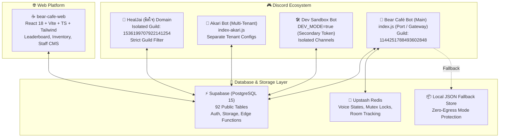
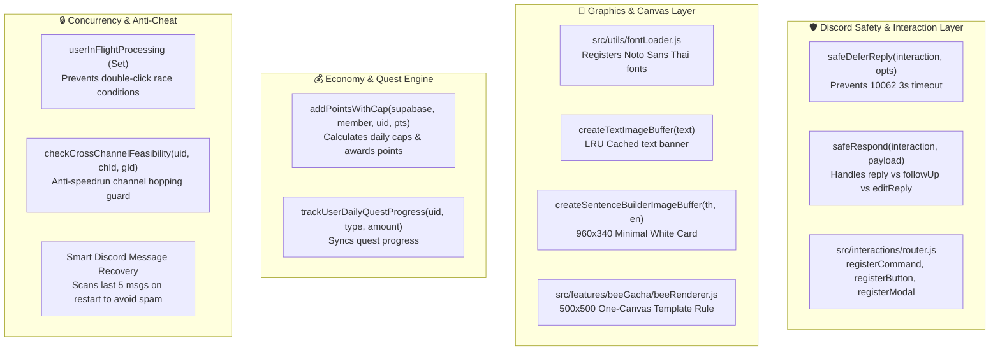

# 🐻 Bear Café Ecosystem — Project Agent Rules & System Architecture

> **Official System Prompt & Operational Guide for AI Agents**  
> **Workspace Root:** `d:\bearcafe-bot` (Discord Bot Ecosystem) & `d:\bear-cafe-web` (Web Application)  
> **Last Updated:** September 2026

---

## 1. Project Overview & Multi-System Architecture

The Bear Café ecosystem is a multi-platform community platform consisting of Discord bots, a web management dashboard, real-time audio/chat point tracking, mini-games, and mental health support services.



### 1.1 Tech Stack & Environment
- **Discord Bot Core:** Node.js (>=20.x), `discord.js` v14.14.1
- **Database:** Supabase (`@supabase/supabase-js` v2.39.0), PostgreSQL 15, Row-Level Security (RLS)
- **High-Speed Cache & Concurrency:** `@upstash/redis` (Serverless Redis REST)
- **Native Graphics & Canvas:** `@napi-rs/canvas` (Rust-powered high-performance 2D Canvas)
- **Voice & Speech:** `google-tts-api` (Audio minigame audio synthesis)
- **Web Frontend:** React 18, TypeScript, Vite, Tailwind CSS, Lucide Icons, Shadcn UI
- **Process & Dev Orchestration:** `nodemon`, PM2, multi-mode environment (`DEV_MODE`, `LOCAL_FAST_START`)

### 1.2 Multi-Domain & Guild Isolation
1. **Bear Café Guild (`GUILD_ID = 1144251788493602848`):** Main community server hosting voice rooms, 13 minigames, bee gacha, check-ins, daily quests, and cafe simulation.
2. **HealJai Guild (`HEALJAI_GUILD_ID = 1536199707922141254`):** Confidential mental health support server. Strictly isolated via `utils/guildFilter.js`. Bear Café prefix/slash commands never execute here; HealJai features only execute in this guild.
3. **Akari Bot (`index-akari.js`):** Independent multi-tenant bot running on a separate token with tenant-isolated database tables (`tenant_minigame_settings`, `akari_minigame_questions`).
4. **Dev Sandbox (`DEV_MODE=true`):** Runs on `SECONDARY_BOT_TOKEN`, scoped strictly to `DEV_CHANNEL_IDS`, selectively loads `DEV_FEATURES`, and exclusively hosts `/send-component`.

---

## 2. Available Skills & Tool Integrations Catalog

The agent has access to a structured hierarchy of tools and skills. Follow these exact conditions when selecting a tool or skill.

### 2.1 The 6 Core Workflow Skills (`.agents/skills`)

```
   [Feature Request / Refactor]             [Bug Report / Error Incident]
                 │                                        │
                 ▼                                        ▼
          1. @skill-plan                           1. @skill-debug
                 │                                        │
                 ▼                                        ▼
         2. @skill-feature                         2. @skill-review
                 │                                        │
                 ▼                                        ▼
          3. @skill-review                         3. @skill-learn (If tech quirk)
                 │                                        │
                 ▼                                        ▼
          4. @skill-ship                           4. @skill-ship
```

| Skill Name | Path | Trigger Condition | Operational Mandate |
|---|---|---|---|
| **`@skill-plan`** | `.agents/skills/skill-plan/` | New feature, major refactor, ambiguous requirements | Search active codebase, perform trade-off analysis (e.g. Supabase vs In-Memory), create implementation plan. Do NOT write code yet. |
| **`@skill-feature`** | `.agents/skills/skill-feature/` | Ready to build or refactor code | Execute 3-tier implementation (Service -> Controller -> UI). Run Cross-System Blast Radius check across Bot, DB, and `bear-cafe-web`. |
| **`@skill-debug`** | `.agents/skills/skill-debug/` | Error logs, crashes, behavioral mismatches | Investigate Root Cause (Expected vs Actual), produce safe minimal patch, verify post-fix. |
| **`@skill-review`** | `.agents/skills/skill-review/` | Code implementation complete | Audit 4 dimensions: Discord Safety (3s timeout), Supabase RLS/Egress, Clean Code, and declare **"Good Enough"** to halt over-engineering. |
| **`@skill-ship`** | `.agents/skills/skill-ship/` | Pre-deploy & task completion | Audit secrets/debug logs, generate Discord Markdown team summary, execute Conventional Commit and Git Push. |
| **`@skill-learn`** | `.agents/skills/skill-learn/` | Complex bug solved, tech quirk discovered | Record SOP and technical nuances into `.agents/KNOWLEDGE.md`. |

### 2.2 Specialized Database Skills
- **`@supabase`**: Triggered when modifying Supabase Auth, Edge Functions, RPCs, Storage, Realtime, or client SDK calls.
- **`@supabase-postgres-best-practices`**: Mandatory guide for schema migrations, indexing, locking, foreign keys, JSONB queries, and query performance.

### 2.3 Supabase MCP Server Tools (`mcpServers.supabase`)
Connected to live Supabase project `orbxyyjpvpbqwfssnyeq`:
- **`execute_sql`**: Execute raw SQL queries (SELECT, INSERT, UPDATE, DELETE). Use for data inspection and DML.
- **`apply_migration`**: Apply DDL migrations (CREATE TABLE, ALTER TABLE, CREATE INDEX).
- **`list_tables` / `list_migrations` / `list_extensions`**: Inspect database schema state.
- **`query_logs` / `get_advisors`**: Query Postgres error/slow query logs and security advisors.
- **`generate_typescript_types`**: Generate sync types for `bear-cafe-web`.

### 2.4 Project Custom Functions & Internal Utilities



---

## 3. Coding Standards & Conventions

### 3.1 The Dual-Directory Mirroring Rule (`src/features` <-> `src/main/features`)
> [!CRITICAL]
> **Mirror Invariant:** `src/features/` and `src/main/features/` must remain **100% identical**.  
> Whenever you modify or add a file in `src/features/...`, you MUST immediately mirror the exact same file to `src/main/features/...` (and vice-versa). Never leave one side outdated.

### 3.2 Clean 3-Tier Layering Architecture
Every feature must strictly separate concerns:
1. **Service Layer (`*Manager.js`, `*Generator.js`, `*Service.js`):**
   - Pure business logic and database interactions.
   - Must implement zero-egress fallback when Supabase is offline/restricted.
   - Independent of Discord interaction objects.
2. **Controller Layer (`router.js`, `interactions/`, event listeners):**
   - Receives Discord interactions.
   - Immediate parameter extraction and validation.
   - Responsible for calling `safeDeferReply` and handing off to the Service Layer.
3. **View / Payload Layer (`*Payload.js`, Canvas renderers):**
   - Pure UI rendering functions returning Discord Component V2 or Embed payloads.
   - Canvas generation with caching.

### 3.3 Discord Interaction Rules (Zero-Exception Mandates)
1. **The 3-Second Timeout Rule:**
   ```javascript
   // ALWAYS defer immediately on any async work
   const { safeDeferReply, safeRespond } = require("../../../utils/discordSafety");
   await safeDeferReply(interaction, { flags: MessageFlags.Ephemeral });
   ```
2. **Interaction Source Detection:**
   When responding to an interaction, determine if it is already ephemeral:
   ```javascript
   const isEphemeral = interaction.message && (interaction.message.flags?.has(MessageFlags.Ephemeral) || Boolean(interaction.message.flags?.bitfield & 64));
   if (isEphemeral) {
     await interaction.update(payload);
   } else {
     await interaction.reply({ ...payload, flags: FLAG_EPHEMERAL });
   }
   ```
3. **Discord Event Deprecation:**
   - Always use `client.once("clientReady", ...)` — NEVER `client.once("ready", ...)`.

### 3.4 Discord Components V2 Specification (`flags: 32768`)
> [!WARNING]
> Discord will reject the payload with `MESSAGE_CANNOT_USE_LEGACY_FIELDS_WITH_COMPONENTS_V2` if rules are violated.

- **Rule 1 (No Top-Level Content):** When `flags: 32768` is used, the root `content` MUST be omitted or `null`. All text must reside in Text Components (`type: 10`) inside a Container (`type: 17`).
- **Rule 2 (No Trailing Separator):** The last component inside a Container (`type: 17`) **MUST NOT be a Separator/Divider (`type: 14`)**. If there are no ActionRows/Buttons below it, omit the trailing separator.
- **Rule 3 (Max 5 Buttons per Row):** ActionRows (`type: 1`) hold a maximum of 5 buttons (`type: 2`). Chunk button arrays into groups of 5.

### 3.5 Naming & Style Conventions
- **Custom IDs:** Prefix with system abbreviation and game ID (e.g. `mg_sb_13_${index}_${timestamp}`, `bee_gacha_${action}`).
- **Database Tables & Columns:** Standard PostgreSQL `snake_case` (e.g. `minigame_questions`, `word_or_question`).
- **JavaScript Code:** `camelCase` for functions and variables, `PascalCase` for classes/constructors, `UPPER_SNAKE_CASE` for constants.
- **Console Logs:** Prefix with subsystem tag (e.g. `[minigames]`, `[dailyQuest]`, `[voicePoints]`).

---

## 4. Design & UI Guidelines

### 4.1 Brand Identity & Color Palette
Inspired by a cozy illustrated café, honey, desserts, and warm night atmosphere:
- **Primary Background:** `#12100E` (Warm dark night)
- **Secondary / Card Background:** `#1D1815` (Elevated card background)
- **Honey Accent:** `#ECA850` / `#F4BE72`
- **Soft Cream Text:** `#F5EBE6`
- **Muted Text:** `#A89F91`
- **Card Borders:** `#2D2520` (or `#CBD5E1` for clean light canvas cards)
- **Forbidden Aesthetics:** Neon cyberpunk, sharp corporate enterprise SaaS, harsh high-contrast borders.

### 4.2 Standard Custom Emojis (`EMOJIS.md`)
Always use established custom emojis for consistent branding:

| Category | Emoji Reference | Raw Discord Format | Use-Case |
|---|---|---|---|
| **Headers** | `bee20000` | `<:bee20000:1256669436350562355>` | Primary section header (`###`) |
| **Inventory** | `bagpack_icon` | `<:bagpack_icon:1522154708200849449>` | Profile, Points, Inventory headers |
| **Currency** | `strawberryv2` | `<:strawberryv2:1520439075100688614>` | Main community point currency |
| **Currency** | `cake_point` | `<:cake_point:1522152896035033098>` | Role exchange cake tokens |
| **Success** | `50121checkmark` | `<:50121checkmark:1358584609087946867>` | Transaction successful / Confirmed |
| **Failure** | `68440x` | `<:68440x:1358584606911369226>` | Error / Rejected / Insufficient points |
| **Mascots** | `bear7` | `<:bear7:1148271118709436416>` | Permission warning / Bear mascot |
| **Mascots** | `cat5` | `<:cat5:1297905123498000394>` | Playful alert / Cat mascot |
| **Welcome** | `bear_hi` | `<a:bear_hi:1144698250306257037>` | Animated welcome mascot |

### 4.3 Canvas Rendering Standards
1. **Font Loading:** Always `require('../utils/fontLoader')` before canvas operations to register `Noto Sans Thai`.
2. **Buffer Caching:** Always cache generated PNG buffers in an in-memory LRU Map (max 300 entries) to prevent CPU spikes and rate limits.
3. **One-Canvas Template Rule:** For character/avatar compositing (e.g. Bee Gacha), all asset PNGs must be drawn onto a fixed `500x500` transparent canvas at `(0, 0)`.

---

## 5. Database & Data Schema Context

### 5.1 Primary Database Tables (Supabase)

```
┌─────────────────────────────────┐       ┌─────────────────────────────────┐
│       minigame_settings         │       │       minigame_questions        │
├─────────────────────────────────┤       ├─────────────────────────────────┤
│ game_id (INT, PK)               │◄──┐   │ id (BIGINT, PK)                 │
│ game_name (TEXT)                │   └───┤ game_id (INT, FK)               │
│ channel_id (TEXT)               │       │ word_or_question (TEXT)         │
│ is_enabled (BOOLEAN)            │       │ answer (TEXT)                   │
│ min_points (INT)                │       │ hints (JSONB)                   │
│ max_points (INT)                │       │ options (JSONB)                 │
│ updated_at (TIMESTAMPTZ)        │       │ category (TEXT)                 │
└─────────────────────────────────┘       │ difficulty (TEXT)               │
                                          │ is_active (BOOLEAN)             │
                                          └─────────────────────────────────┘
┌─────────────────────────────────┐       ┌─────────────────────────────────┐
│          user_points            │       │         minigame_wins           │
├─────────────────────────────────┤       ├─────────────────────────────────┤
│ discord_id (TEXT, PK)           │◄──┐   │ id (BIGINT, PK)                 │
│ points (INT)                    │   └───┤ discord_id (TEXT)               │
│ total_earned (INT)              │       │ game_id (INT)                   │
│ updated_at (TIMESTAMPTZ)        │       │ points_earned (INT)             │
└─────────────────────────────────┘       │ created_at (TIMESTAMPTZ)        │
                                          └─────────────────────────────────┘
```

#### Minigames Engine (`13 Active Games`):
- `minigame_settings`: Stores per-game channel mapping, enabled status, and point range (`min_points` to `max_points`).
- `minigame_questions`: Pool of questions.
  - **Game 13 (Sentence Builder):** `hints` stores the template `["I am {1} forward to {2} you."]`, `answer` stores CSV `looking,seeing`. The `options` column is **optional** (`[]`); if empty, the bot automatically generates random distractors from other questions and the common English pool.
- `minigame_wins`: Append-only history of minigame wins for leaderboards and quest verification.
- `minigame_active_sessions`: Active game state per Discord channel to persist questions across restarts.

#### Economy & Quests:
- `user_points`: Balances and lifetime earnings.
- `daily_quest_master` & `user_daily_quests`: Daily quest templates and per-user daily progress (`MINIGAME_PLAY`, `MINIGAME_WIN`, `VOICE_MINUTES`, etc.).
- `checkin_cycles` & `checkin_logs`: 28-day progressive check-in calendar.

#### Mental Health (HealJai):
- `heal_jai_tickets`: Private staff-to-user support ticket lifecycle.
- `heal_jai_consents`: Consent tracking for anonymous support.

### 5.2 Zero-Egress Architecture (Fallback Mode)
- Never allow a Supabase outage or egress quota restriction (`402 Payment Required`) to crash the bot.
- Service functions must detect `if (!supabase)` or caught network errors and smoothly degrade to Local JSON Stores (`mockStorage.js`, `mockDailyQuestStore.js`).

---

## 6. Agent Operational Guidelines (Do's & Don'ts)

### 6.1 Absolute Must-Do's (DO)
1. **Always Mirror Code:** Sync changes between `src/features/` and `src/main/features/` immediately.
2. **Use Slash Command `/send-component` for Boards:**
   - **DEV-ONLY:** `/send-component` must only be registered in development (`DEV_MODE=true` on `SECONDARY_BOT_TOKEN`).
   - Never use old prefix commands like `b!reset-terms`, `b!reset-menu`, or `b!...` for Discord boards.
3. **Execute Pre-flight Syntax Checks:** Run `node -c <modified_files>` before reporting completion.
4. **Enforce Cross-System Blast Radius Scanning:** When modifying game IDs, custom IDs, or database schemas, check and update both the Discord bot and `bear-cafe-web`.
5. **Always Acknowledge Interactions within 3 Seconds:** Call `safeDeferReply` immediately in any asynchronous interaction handler.
6. **Use Supabase MCP Tools for Database Operations:** Use `execute_sql` for queries and `apply_migration` for DDL rather than raw terminal scripts where possible.

### 6.2 Absolute Must-Not-Do's (DON'T)
1. **NEVER expose `/send-component` on Production:** It must never be registered on the Production Main Bot (`Bear Café`).
2. **NEVER use top-level `content` with Component V2 (`flags: 32768`):** Text must be in Text Components (`type: 10`) inside Containers (`type: 17`).
3. **NEVER end a Component V2 Container with a Separator (`type: 14`):** If there are no buttons below, omit the divider.
4. **NEVER run destructive database commands (`DROP TABLE`, `TRUNCATE`)** without explicit user confirmation and backups.
5. **NEVER send unthrottled repetitive Discord messages on restart:** Always scan the last 5 messages in the channel to recover the existing question before sending a new one.
6. **NEVER hardcode secrets or Discord channel IDs:** Read from `process.env`, `config.js`, or the `minigame_settings` database table.
