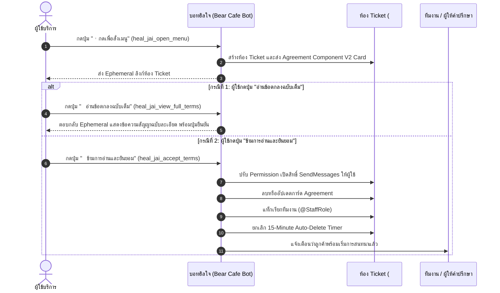

# การออกแบบ Discord Component V2: การ์ดข้อตกลงและเงื่อนไข (Agreement Card)
**โปรเจกต์:** ฮิลใจ (HealJai)  
**ตำแหน่งไฟล์:** `d:\bearcafe-bot\src\features\healJai\AGREEMENT_COMPONENT_V2.md`  
**อ้างอิงจาก:** Component V2 JSON Template (Webhook: `1536272012748525609`)  
**สถานะ:** เอกสารการออกแบบและสเปกโครงสร้าง (Design & Specification Document)

---

## 1. ภาพรวมและวัตถุประสงค์ (Overview & Objectives)

การ์ด **"ข้อตกลงและเงื่อนไขการใช้บริการ" (Agreement Card)** ใช้แสดงผลในห้อง Ticket ส่วนตัวเมื่อผู้ใช้บริการกดเปิดห้องจากเมนูหลัก เพื่อให้ผู้ใช้ได้อ่าน ทำความเข้าใจขอบเขตการให้บริการ ข้อจำกัดความรับผิดชอบ และนโยบายทางการเงิน ก่อนเริ่มการสนทนาจริง

### วัตถุประสงค์หลัก:
1. **สร้างความชัดเจนทางกฎหมายและขอบเขตบริการ:** ระบุชัดเจนว่าไม่ใช่การบำบัดทางการแพทย์
2. **สร้างความโปร่งใสทางนโยบาย:** กำหนดเงื่อนไขการชำระเงิน การคืนเงิน และส่วนแบ่งรายได้ 70% ของผู้ให้คำปรึกษา
3. **ยกระดับความสวยงามด้วย Discord Component V2:** ใช้ Container (Type 17), Separator (Type 14), Text Display (Type 10), Media Gallery (Type 12) และ Action Row (Type 1)

---

## 2. โครงสร้างจำลองหน้าตา (Visual Wireframe Layout)

```
┌────────────────────────────────────────────────────────────────────────┐
│ [Type 17: Container]                                                   │
│                                                                        │
│   [Type 14: Separator (spacing: 1, divider: false)]                    │
│                                                                        │
│   [Type 10: Text Display]                                              │
│   ## 🍀︲__` 𝖠𝗀𝗋𝖾𝖾𝗆𝖾𝗇𝗍 ₊ ข้อตกลงและเงื่อนไขการใช้บริการ 𓂃 `__               │
│   -# ยินดีต้อนรับสู่พื้นที่ให้คำปรึกษาและรับฟังของเรา...               │
│                                                                        │
│   **สิ่งสำคัญที่ควรรู้:**                                              │
│   (🩹) บริการนี้ไม่ใช่การบำบัดหรือการรักษาทางการแพทย์                 │
│   (💸) การชำระเงินต้องดำเนินการก่อนเริ่มบริการ                         │
│   (⚠️) การละเมิดกฎอาจทำให้ยุติบริการโดยไม่มีการคืนเงิน                 │
│   (💰) ผู้ให้คำปรึกษาได้รับส่วนแบ่ง 70% จากยอดสุทธิที่ลูกค้าชำระจริง   │
│   (↩️) มีเงื่อนไขการคืนเงินและการชดเชยในกรณีผู้ให้คำปรึกษาทำผิดกฎ     │
│   (🔒) ข้อมูลการสนทนาและประวัติการใช้งานมีนโยบายการจัดเก็บและรักษาลับ │
│                                                                        │
│   **การเริ่มใช้บริการหรือสมัครเป็นผู้ให้คำปรึกษา ถือว่ายอมรับเงื่อนไข**│
│                                                                        │
│   ──────────────────────────────────────────────────────────────────   │
│   [Type 14: Separator (spacing: 2, divider: true)]                     │
│                                                                        │
│   [Type 12: Media Gallery]                                             │
│   ┌────────────────────────────────────────────────────────────────┐   │
│   │                                                                │   │
│   │                 [ Banner Image: 1200 x 480 ]                   │   │
│   │              "HealJai 2026 ZEAB1U All Rights Reserved"         │   │
│   │                                                                │   │
│   └────────────────────────────────────────────────────────────────┘   │
│                                                                        │
│   [Type 14: Separator (divider: false)]                                │
│                                                                        │
│   [Type 1: Action Row]                                                 │
│   ┌─────────────────────────────┐  ┌────────────────────────────────┐  │
│   │ 💚 อ่านข้อตกลงฉบับเต็ม      │  │ ✅ ข้ามการอ่านและยินยอม        │  │
│   │ [Style 2: Secondary / Grey] │  │ [Style 2: Secondary / Grey]    │  │
│   └─────────────────────────────┘  └────────────────────────────────┘  │
│                                                                        │
└────────────────────────────────────────────────────────────────────────┘
```

---

## 3. รายละเอียดชิ้นส่วน Component V2 (Element-by-Element Breakdown)

| ลำดับ | Component Type | ชนิด | ค่าการตั้งค่า (Properties) | หน้าที่และการแสดงผล |
| :---: | :---: | :---: | :--- | :--- |
| **-** | `flags` | Message Flags | `32768` (`FLAG_V2`) | เปิดโหมดเรนเดอร์ Discord Component V2 |
| **1** | `17` | **Container** | `accent_color: null`<br>`spoiler: false` | กล่องกรอบนอกสุดล้อมรอบเนื้อหาทั้งหมด |
| **2** | `14` | **Separator** | `spacing: 1`<br>`divider: false` | เว้นระยะห่างด้านบนหัวข้อ 1 หน่วย เพื่อความโปร่งตา |
| **3** | `10` | **Text Display** | Markdown Format:<br>- หัวข้อ `##` ขีดเส้นใต้ `__` และโค้ดบล็อก ` ` <br>- คำอธิบายตัวเล็ก `-#` (Subtext)<br>- รายการ Bulleted พร้อมสัญลักษณ์อิโมจิ | ข้อความชี้แจงเงื่อนไขสำคัญ 6 ประการ และข้อความเตือนการยอมรับเงื่อนไข |
| **4** | `14` | **Separator** | `spacing: 2`<br>`divider: true` | เส้นคั่นสีเทาแบ่งระหว่างข้อความและแบนเนอร์รูปภาพ |
| **5** | `12` | **Media Gallery** | `width: 1200, height: 480`<br>`url: CDN Link`<br>`aspect_ratio: 2.5 : 1` | แสดงภาพกราฟิกแบนเนอร์ลิขสิทธิ์ของ HealJai 2026 |
| **6** | `14` | **Separator** | `spacing: 1`<br>`divider: false` | เว้นระยะห่างระหว่างรูปภาพกับแผงปุ่มกด |
| **7** | `1` | **Action Row** | รวมปุ่มกด 2 ชิ้นแนวนอน | แถวควบคุมสำหรับผู้ใช้ตอบสนอง |
| **7.1** | `2` | **Button 1** | `style: 2` (Secondary / สีเทาอ่อน)<br>`label: "⠀อ่านข้อตกลงฉบับเต็ม"`<br>`emoji: heartgreen` | เปิดหน้าต่างข้อตกลงฉบับเต็ม (Modal / Ephemeral) |
| **7.2** | `2` | **Button 2** | `style: 2` (Secondary / สีเทาอ่อน)<br>`label: "⠀ข้ามการอ่านและยินยอม"`<br>`emoji: 50121checkmark` | ยืนยันยอมรับเงื่อนไขทันที และแจ้งเตือนทีมงาน |

---

## 4. สารบัญอิโมจิที่ใช้ในการ์ด (Emojis Directory)

| Emoji Name | Emoji Format | Emoji ID | ประเภท | จุดประสงค์การใช้งาน |
| :--- | :--- | :--- | :---: | :--- |
| **fourleafclover** | `<a:fourleafclover:1536711677699952680>` | `1536711677699952680` | Animated | ไอคอนนำหน้าหัวข้อใหญ่ `Agreement` |
| **heartoutlines** | `<a:heartoutlines:1536268541144076369>` | `1536268541144076369` | Animated | ไอคอนตกแต่งปิดท้ายข้อความชี้แจง |
| **heartgreen** | `<:heartgreen:1536699719055839313>` | `1536699719055839313` | Static | ไอคอนประจำปุ่ม `อ่านข้อตกลงฉบับเต็ม` |
| **50121checkmark** | `<:50121checkmark:1358584609087946867>` | `1358584609087946867` | Static | ไอคอนประจำปุ่ม `ข้ามการอ่านและยินยอม` |

---

## 5. การออกแบบระบบโต้ตอบ (Interaction Flow & Custom IDs)

เพื่อให้รองรับสถาปัตยกรรมของบอท Discord.js v14 เราแปลงค่า Flow ใน JSON Template มาเป็นมาตรฐาน Custom IDs ประจำระบบฮิลใจดังนี้:

### 5.1 รายการ Custom IDs ประจำการ์ด:
```javascript
const CUSTOM_IDS = {
  // เมนูเดิม
  OPEN_MENU: "heal_jai_open_menu",
  
  // การ์ดข้อตกลงใหม่ (Agreement Card)
  VIEW_FULL_TERMS: "heal_jai_view_full_terms",     // ปุ่ม "อ่านข้อตกลงฉบับเต็ม"
  ACCEPT_TERMS: "heal_jai_accept_terms",           // ปุ่ม "ข้ามการอ่านและยินยอม"
  CANCEL_TICKET: "heal_jai_cancel_ticket",         // ปุ่ม "ยกเลิกการทำรายการ"
};
```

### 5.2 แผนภาพลำดับการทำงาน (Sequence Flow):



---

## 6. โค้ด JavaScript สำหรับสร้าง Payload (Payload Generator Function)

ฟังก์ชันนี้สามารถนำไปวางใน `d:\bearcafe-bot\src\features\healJai\index.js` หรือแยกเป็นโมดูลย่อยใน `src/features/healJai/components/agreementPayload.js` ได้ทันที:

```javascript
// ===================================================
// src/features/healJai/components/agreementPayload.js
// Payload สำหรับการ์ดข้อตกลงและเงื่อนไขการใช้บริการ (HealJai Agreement Component V2)
// ===================================================

const { MessageFlags } = require("discord.js");

const FLAG_V2 = MessageFlags.IsComponentsV2 || 32768;

const HEALJAI_EMOJIS = {
  CLOVER: "<a:fourleafclover:1536711677699952680>",
  HEART_OUTLINES: "<a:heartoutlines:1536268541144076369>",
  HEART_GREEN_ID: "1536699719055839313",
  CHECKMARK_ID: "1358584609087946867",
};

const BANNER_IMAGE_URL =
  "https://cdn.discordapp.com/attachments/1536267579843280987/1545266433909325845/HealJai_2026_ZEAB1U_._All_Rights_Reserved._1.png?ex=6a9b8503&is=6a9a3383&hm=e873f94878b2dcd7345927a193b10c73ef8d345f410127b8fed3b3e3900524c8&";

/**
 * สร้าง Payload การ์ดข้อตกลงและเงื่อนไข Component V2
 * @returns {object} Discord Message Payload
 */
function getAgreementPayload() {
  return {
    flags: FLAG_V2,
    components: [
      {
        type: 17, // Container
        components: [
          {
            type: 14, // Separator
            spacing: 1,
            divider: false,
          },
          {
            type: 10, // Text Display
            content:
              `## ${HEALJAI_EMOJIS.CLOVER}︲__\` 𝖠𝗀𝗋𝖾𝖾𝗆𝖾𝗇𝗍 ₊ ข้อตกลงและเงื่อนไขการใช้บริการ 𓂃 \`__\n` +
              `-# ยินดีต้อนรับสู่พื้นที่ให้คำปรึกษาและรับฟังของเรา โปรดอ่านและทำความเข้าใจข้อตกลงต่อไปนี้ก่อนเริ่มใช้งานบริการ การเริ่มชำระเงินหรือสมัครเป็นผู้ให้คำปรึกษา ถือว่าคุณยอมรับเงื่อนไขทั้งหมดนี้\n\n` +
              `**สิ่งสำคัญที่ควรรู้:**\n` +
              `(🩹)⠀บริการนี้ไม่ใช่การบำบัดหรือการรักษาทางการแพทย์\n` +
              `(💸)⠀การชำระเงินต้องดำเนินการก่อนเริ่มบริการ\n` +
              `(⚠️)⠀การละเมิดกฎอาจทำให้ยุติบริการโดยไม่มีการคืนเงิน\n` +
              `(💰)⠀ผู้ให้คำปรึกษาได้รับส่วนแบ่ง 70% จากยอดสุทธิที่ลูกค้าชำระจริง\n` +
              `(↩️)⠀มีเงื่อนไขการคืนเงินและการชดเชยในกรณีผู้ให้คำปรึกษาทำผิดกฎ\n` +
              `(🔒)⠀ข้อมูลการสนทนาและประวัติการใช้งานมีนโยบายการจัดเก็บและรักษาความลับ\n\n` +
              `**การเริ่มใช้บริการหรือสมัครเป็นผู้ให้คำปรึกษา ถือว่าคุณยอมรับข้อตกลงและเงื่อนไขทั้งหมด** ${HEALJAI_EMOJIS.HEART_OUTLINES}`,
          },
          {
            type: 14, // Separator
            spacing: 2,
            divider: true,
          },
          {
            type: 12, // Media Gallery
            items: [
              {
                media: {
                  url: BANNER_IMAGE_URL,
                },
                spoiler: false,
              },
            ],
          },
          {
            type: 14, // Separator
            spacing: 1,
            divider: false,
          },
          {
            type: 1, // Action Row
            components: [
              {
                type: 2, // Button
                style: 2, // Secondary (Grey)
                custom_id: "heal_jai_view_full_terms",
                label: "⠀อ่านข้อตกลงฉบับเต็ม",
                emoji: {
                  id: HEALJAI_EMOJIS.HEART_GREEN_ID,
                  name: "heartgreen",
                  animated: false,
                },
              },
              {
                type: 2, // Button
                style: 2, // Secondary (Grey)
                custom_id: "heal_jai_accept_terms",
                label: "⠀ข้ามการอ่านและยินยอม",
                emoji: {
                  id: HEALJAI_EMOJIS.CHECKMARK_ID,
                  name: "50121checkmark",
                  animated: false,
                },
              },
            ],
          },
        ],
      },
    ],
  };
}

module.exports = {
  getAgreementPayload,
};
```

```

---

## 7. คำสั่ง Slash Command `/send-component` (สำหรับส่งการ์ดแบบ Standalone)

- **ชื่อคำสั่ง:** `/send-component`
- **ขอบเขต:** ลงทะเบียนเฉพาะในเซิร์ฟเวอร์ฮิลใจ (`HEALJAI_GUILD_ID: 1536199707922141254`) เท่านั้น
- **ตัวเลือก (Option):**
  - ชื่อ: `ตัวเลือก` (จำเป็นต้องระบุ - Required)
  - ตัวเลือกย่อย (Choice): `ข้อตกลง` (`value: "agreement"`)
- **พฤติกรรมการส่ง (แบบไม่ติดกับคำสั่ง /slash):**
  1. บอทเรียก `interaction.channel.send(getMainAgreementPayload())` เพื่อส่งการ์ดข้อตกลงลงห้องแชทโดยตรง เป็นข้อความปกติของบอทที่ไม่มีหัวข้อ "username ได้ใช้คำสั่ง /send-component"
  2. ตอบกลับการเรียกใช้คำสั่งเฉพาะตัวแอดมินแบบ Ephemeral: `interaction.reply({ content: "✅ ส่ง Component V2 (ข้อตกลง) เรียบร้อยแล้วค่ะ", flags: MessageFlags.Ephemeral })`

---

## 8. ระบบการตอบสนองเมื่อผู้ใช้กดปุ่ม (Button Handlers Specification)

### 8.1 เมื่อกดปุ่ม `heal_jai_view_full_terms` ("⠀อ่านข้อตกลงฉบับเต็ม")
- **รูปแบบ:** แสดงผลแบบเฉพาะผู้ใช้ (Ephemeral: `flags: 32768 | 64`)
- **เนื้อหา:** นำ Container ข้อตกลงเดิมมาเปลี่ยน `content` เป็นข้อความสัญญาฉบับละเอียด 7 ข้อ:
  1. ขอบเขตการให้บริการ (ไม่ใช่การบำบัดรักษาทางการแพทย์)
  2. สำหรับผู้รับบริการ (การชำระเงิน, ข้อห้าม, นโยบายคืนเงิน 100%)
  3. สำหรับผู้ให้คำปรึกษา (สถานะพาร์ทไทม์, ห้ามรับงานนอก, การรักษาความลับ)
  4. ระบบรายได้และการจ่ายเงิน (ส่วนแบ่ง 70% ตัดรอบวันที่ 15 และสิ้นเดือน ขั้นต่ำ 100 บาท)
  5. โปรโมชั่นและส่วนลด (คิด 70% จากยอดสุทธิที่ชำระจริง)
  6. ความเป็นส่วนตัว (การรักษาความลับและการเก็บ Log ตามระยะเวลา)
  7. การยอมรับข้อตกลง

### 8.2 เมื่อกดปุ่ม `heal_jai_accept_terms` ("⠀ข้ามการอ่านและยินยอม")
- **รูปแบบ:** แสดงผลแบบเฉพาะผู้ใช้ (Ephemeral: `flags: 32768 | 64`)
- **โครงสร้าง:** ส่ง 2 Containers ซ้อนกัน:
  - **Container 1:** การ์ดข้อตกลงเดิม
  - **Container 2:** การ์ดบันทึกการยินยอมสำเร็จ:
    - ระบุชื่อผู้ใช้งาน `<@userId>`
    - เวอร์ชันข้อตกลง `v1.0`
    - เวลาที่บันทึกจริงในประเทศไทย (`DD/MM/YYYY HH:mm น.`)
    - ขั้นตอนถัดไป: ชี้ทางไปยังห้อง `<#1536206516359532665>`
- **การเพิ่มบทบาท (Role Assignment):**
  - เพิ่ม Role ID: `1545271910328180777` ให้กับผู้ใช้ทันที
- **การบันทึกฐานข้อมูล (Database Logging):**
  - บันทึกลงตารางใหม่: `heal_jai_consents` (พร้อม local cache fallback)

---

## 9. อ้างอิง Raw JSON ต้นฉบับ (Raw JSON Reference)

<details>
<summary>คลิกเพื่อดู JSON ต้นฉบับจาก Webhook 1536272012748525609</summary>

```json
{
  "content": "",
  "embeds": [],
  "attachments": [],
  "webhook_id": "1536272012748525609",
  "components": [
    {
      "type": 17,
      "id": 1,
      "accent_color": null,
      "components": [
        {
          "type": 14,
          "id": 3,
          "spacing": 1,
          "divider": false
        },
        {
          "type": 10,
          "id": 4,
          "content": "## <a:fourleafclover:1536711677699952680>︲__` 𝖠𝗀𝗋𝖾𝖾𝗆𝖾𝗇𝗍 ₊ ข้อตกลงและเงื่อนไขการใช้บริการ 𓂃 `__\n-# ยินดีต้อนรับสู่พื้นที่ให้คำปรึกษาและรับฟังของเรา โปรดอ่านและทำความเข้าใจข้อตกลงต่อไปนี้ก่อนเริ่มใช้งานบริการ การเริ่มชำระเงินหรือสมัครเป็นผู้ให้คำปรึกษา ถือว่าคุณยอมรับเงื่อนไขทั้งหมดนี้\n\n**สิ่งสำคัญที่ควรรู้:**\n(🩹)⠀บริการนี้ไม่ใช่การบำบัดหรือการรักษาทางการแพทย์\n(💸)⠀การชำระเงินต้องดำเนินการก่อนเริ่มบริการ\n(⚠️)⠀การละเมิดกฎอาจทำให้ยุติบริการโดยไม่มีการคืนเงิน\n(💰)⠀ผู้ให้คำปรึกษาได้รับส่วนแบ่ง 70% จากยอดสุทธิที่ลูกค้าชำระจริง\n(↩️)⠀มีเงื่อนไขการคืนเงินและการชดเชยในกรณีผู้ให้คำปรึกษาทำผิดกฎ\n(🔒)⠀ข้อมูลการสนทนาและประวัติการใช้งานมีนโยบายการจัดเก็บและรักษาความลับ\n\n**การเริ่มใช้บริการหรือสมัครเป็นผู้ให้คำปรึกษา ถือว่าคุณยอมรับข้อตกลงและเงื่อนไขทั้งหมด** <a:heartoutlines:1536268541144076369>"
        },
        {
          "type": 14,
          "id": 5,
          "spacing": 2,
          "divider": true
        },
        {
          "type": 12,
          "id": 2,
          "items": [
            {
              "media": {
                "id": "1542576765161963583",
                "url": "https://cdn.discordapp.com/attachments/1536267579843280987/1545266433909325845/HealJai_2026_ZEAB1U_._All_Rights_Reserved._1.png?ex=6a9b8503&is=6a9a3383&hm=e873f94878b2dcd7345927a193b10c73ef8d345f410127b8fed3b3e3900524c8&",
                "proxy_url": "https://media.discordapp.net/attachments/1536267579843280987/1542569433514643476/NewsBoard_-_bearcafe_28.png?ex=6a9aefbc&is=6a999e3c&hm=5dacd0deb86f4a36eb0e01af40b3d241a8c177d2840a1e5789f59e94044c2f49&",
                "width": 1200,
                "height": 480,
                "placeholder": "OvgFC4CYCFmcmOpE91SWsKs=",
                "placeholder_version": 1,
                "content_type": "image/png",
                "loading_state": 2,
                "flags": 0
              },
              "description": null,
              "spoiler": false
            }
          ]
        },
        {
          "type": 14,
          "divider": false
        },
        {
          "type": 1,
          "id": 6,
          "components": [
            {
              "type": 2,
              "id": 7,
              "custom_id": "",
              "style": 2,
              "label": "⠀อ่านข้อตกลงฉบับเต็ม",
              "emoji": {
                "id": "1536699719055839313",
                "name": "heartgreen"
              },
              "flow": {
                "actions": [
                  {
                    "type": 6,
                    "backupId": "333873529080516609",
                    "backupMessageIndex": 0,
                    "flags": 64
                  }
                ]
              }
            },
            {
              "style": 2,
              "type": 2,
              "label": "⠀ข้ามการอ่านและยินยอม",
              "emoji": {
                "id": "1358584609087946867",
                "name": "50121checkmark",
                "animated": false
              },
              "flow": {
                "actions": [
                  {
                    "type": 6,
                    "backupId": "333873529080516609",
                    "backupMessageIndex": 0,
                    "flags": 64
                  }
                ]
              },
              "custom_id": "p_342845136763359233"
            }
          ]
        }
      ],
      "spoiler": false
    }
  ],
  "flags": 32768
}
```
</details>
