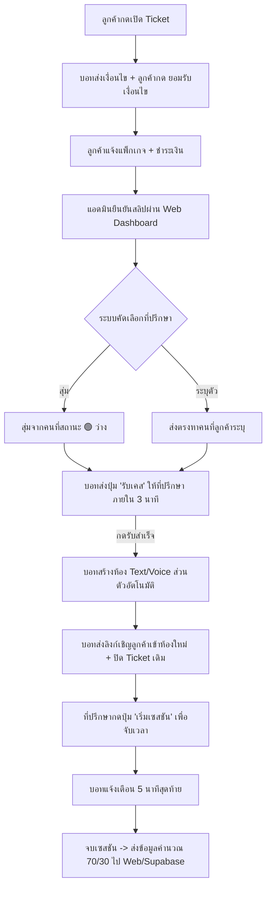

นี่คือโครงร่างเอกสาร Markdown (`PROJECT_OVERVIEW.md`) สรุปภาพรวมของโปรเจกต์ **"Bear Cafe ฮีลใจ"** แบบครบถ้วนและพร้อมนำไปใช้อ้างอิงในการพัฒนาต่อครับ

---

```markdown
# 🐻 Bear Cafe — Automated Healing & Counseling Service
> พื้นที่ปลอดภัยสำหรับรับฟังและให้คำปรึกษาแบบ On-Demand ผ่าน Discord Bot และระบบหลังบ้าน Supabase

---

## 📌 1. ภาพรวมโปรเจกต์ (Project Overview)
* **คอมมูนิตี้เป้าหมาย:** สมาชิก 30,000 คนในเซิร์ฟเวอร์ Bear Cafe (กลุ่มวัยรุ่น/นักเรียน/นักศึกษา)
* **รูปแบบบริการ:** On-Demand / Walk-in Service (รับบริการทันที ไม่ต้องจองคิวล่วงหน้า)
* **สถาปัตยกรรม:** 
  * **Frontend:** Discord Bot (Components V2, SelectMenus, Buttons, Auto-room generation)
  * **Backend & Admin:** Web Application Dashboard + Supabase Database

---

## 💰 2. โครงสร้างราคาและบริการ (Pricing & Tiers)

### 2.1 แพ็กเกจหลัก (Base Packages)
| ชื่อเมนูไทย | ชื่อเมนูอังกฤษ| เวลาสนทนา | ราคาปกติ | ลิงก์ภาพเมนู |
|:---:|:---:|:---:|:---:|:---|
| **ชาเขียวเย็นใจ** | Iced GreenTea | 15 นาที | 39 บาท | https://cdn.discordapp.com/attachments/1536267579843280987/1547550913474854942/New_premium_13.png?ex=6aa3d499&is=6aa28319&hm=0d6a80cbc1608f21dc0ad7fca7783fdd0dd8ba4c6716acdfe5beb3a407ab6ce2& |
| **โกโก้พักใจ** | Cozy Cocoa | 30 นาที | 69 บาท | https://cdn.discordapp.com/attachments/1536267579843280987/1547362521919529081/New_premium_11.png?ex=6aa3cde5&is=6aa27c65&hm=c4d417c2e77129e109e664130ddbdc171778383a7873387115d36d4e044cf432& |
| **กาแฟคุยยาว** | Long Talk Coffee | 1 ชั่วโมง | 129 บาท | https://cdn.discordapp.com/attachments/1536267579843280987/1547550913135251498/New_premium_12.png?ex=6aa3d499&is=6aa28319&hm=3824be073d953a9522eb65d5103a41492a63e760a5917789c274b25e0086a232& |

### 2.2 ท็อปปิ้งเพิ่มเติม (Add-ons)
* **🌙 Silent Companion (+15 บาท):** โหมดนั่งเงียบเป็นเพื่อน ไม่ต้องชวนคุย มีเสียงบรรยากาศพิมพ์งาน (ASMR/Co-working)
* **🎯 เลือกระบุตัวผู้รับฟัง (+30 บาท):** เลือกบาริสต้าหมีที่ถูกใจจากหน้าโปรไฟล์ (ต้องมีสถานะ 🟢 ว่าง)
  * *หมายเหตุ:* หากเลือกทั้ง 2 อย่าง (+45 THB) ระบบจะกรองเฉพาะผู้รับฟังที่มีแท็ก `[⌨️ Silent/ASMR]` เท่านั้น

### 2.3 การแบ่งรายได้และรอบโอน (Revenue Split & Payout)
* **ส่วนแบ่ง:** ผู้รับฟัง 70% / แพลตฟอร์ม 30% (คิดจากยอดสุทธิ)
* **รอบจ่ายเงิน:** วันที่ 15 และสิ้นเดือน (สะสมขั้นต่ำ 100 THB)

---

## 🌟 3. สิทธิพิเศษสำหรับ Server Booster (Perks)
1. **ฟรี! สิทธิผ่อนผันเวลา (Grace Period):** เพิ่มเวลาฟรี +5 นาที ทุกแพ็กเกจ
2. **Priority Matching:** ได้รับการลัดคิวจับคู่เป็นอันดับแรกในระบบสุ่ม
3. **Badge & Role พิเศษ:** แสดงตราสัญลักษณ์ลูกค้าระดับพรีเมียม

---

## 🗂️ 4. ผังการจัดหมวดหมู่ห้องใน Discord (Channel Layout)

```text
🛎️・ขั้นตอนการใช้บริการ (HOW TO USE)
 ├─ 1️⃣・อ่านข้อตกลงและนโยบาย   (Read-only + กฎ + นโยบายไม่คืนเงิน)
 ├─ 2️⃣・เช็คสถานะและโปรไฟล์    (Read-only + สถานะบาริสต้า + แท็กความถนัด)
 ├─ 3️⃣・เลือกเมนูและสั่งบริการ  (Read-only + เมนูราคา + ปุ่ม [📩 เปิด Ticket])
 └─ 4️⃣・จุดชำระเงิน            (Private Ticket Category: ยืนยันเงื่อนไข + ส่งสลิป)

☕・ห้องสนทนาส่วนตัว (SESSIONS)
 └─ 🍵・ห้องสนทนา-xxxx        (Temporary Text & Voice เฉพาะ ลูกค้า + ที่ปรึกษา + แอดมิน)

🛋️・เลานจ์พักใจ (COMMUNITY)
 ├─ 💬・พูดคุยทั่วไป
 ├─ 📝・กระดานระบายความรู้สึก
 └─ 🎵・ห้องนั่งฟังเพลง

🛠️・โซนทีมงาน (STAFF ONLY)
 ├─ 📌・ประกาศทีมงาน
 ├─ ⚙️・ตอกบัตรเข้ากะ          (แผงปุ่มกด: 🟢 พร้อมรับงาน / 🔴 พักเบรก / ⚫ ออฟไลน์)
 ├─ 🔔・แจ้งเตือนรับเคส        (บอทส่งปุ่ม [รับเคส] นับถอยหลัง 3 นาที)
 ├─ 📁・บันทึก-transcripts     (เก็บบันทึกประวัติและ Log การกดยอมรับเงื่อนไข)
 └─ ☕・ห้องพักทีมงาน

```

---

## 🔄 5. ขั้นตอนการทำงานของระบบ (End-to-End Workflow)



---

## 🗄️ 6. โครงสร้างฐานข้อมูลเบื้องต้น (Database Schema Overview)

* **`counselors`**: เก็บข้อมูลผู้รับฟัง, สถานะ (`ONLINE`, `BUSY`, `OFFLINE`), แท็กความถนัด, ยอดเงินสะสม
* **`orders_sessions`**: รหัสบิล, `discord_user_id`, รหัสที่ปรึกษา, แพ็กเกจ, ท็อปปิ้ง, สถานะการชำระเงิน, เวลาเริ่มต้น-สิ้นสุด
* **`consent_logs`**: บันทึกหลักฐานการกดยินยอมเงื่อนไข (`discord_user_id`, `terms_version`, `timestamp`, `channel_id`)
* **`payouts`**: บันทึกประวัติการตัดรอบโอนเงินทุกวันที่ 15 และสิ้นเดือน

---

## 🛡️ 7. กฎความปลอดภัยและข้อกำหนด (Safety & Policies)

* **ไม่ใช่การรักษาทางการแพทย์:** ให้บริการเฉพาะการรับฟังและคำปรึกษาเบื้องต้นเท่านั้น
* **Zero Tolerance ต่อการคุกคาม:** ห้ามใช้คำหยาบ คุกคามทางเพศ หรือละเมิดความเป็นส่วนตัว (ฝ่าฝืนตัดสิทธิ์ทันที ไม่คืนเงิน)
* **ความปลอดภัยของโหมด ASMR:** อนุญาตเฉพาะเสียงพิมพ์งาน ขีดเขียน และบรรยากาศ Co-working เท่านั้น ห้ามทำเสียงล่อแหลม/NSFW
* **ความลับ 100%:** ห้องสนทนาถูกล็อกสิทธิ์ให้เห็นเฉพาะผู้เกี่ยวข้อง และจะถูกซ่อน/ลบทันทีหลังจบงาน

```

---

<FollowUp label="ต้องการให้นำโครงสร้างนี้ไปแปลงเป็น SQL Script สำหรับรันบน Supabase ต่อเลยไหม?" query="ช่วยเขียนโค้ด SQL Table และ RLS Policies สำหรับฐานข้อมูล Supabase ตามโครงสร้างในเอกสารนี้ให้หน่อยค่ะ"/>

```